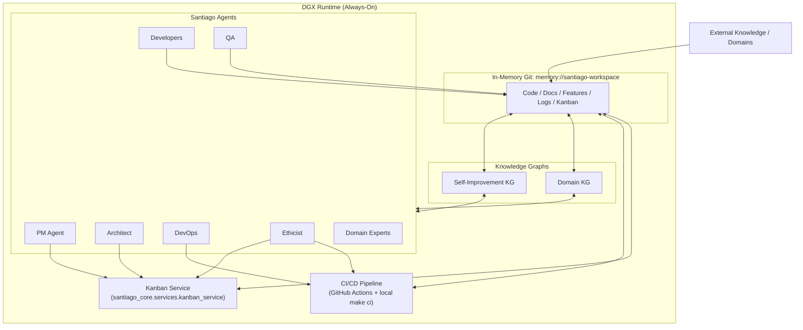

## 1. Vision & Conceptual Architecture

### 1.1 Core Vision

Santiago is a **self-improving, neurosymbolic multi-agent system** that behaves like a seasoned software crew sailing an ocean of knowledge.

**Ocean**: External knowledge and customer domains (guidelines, PDFs, repos, APIs, data).
**Ship (Noesis Runtime)**: The Noesis platform/ship running Santiago-core + agents continuously on DGX, backed by:
  - In-memory Git workspace(s).
  - Knowledge graphs.
  - Kanban and CI/CD.
- **Crew (Santiago Agents)**: Architect, PM, Developers, QA, DevOps, Ethicist, Domain Experts.
- **Shipyard (Self-improvement Mode on DGX)**: Same Noesis runtime, but the crew focuses on:
  - Improving Santiago-core (brain, memory, orchestration).
  - Improving tooling, observability, and safety.
  - Refining workflows and experiments.

**Canonical decisions (from prior answers, now fixed):**

- **Always-on DGX runtime**:
  - Santiago runs 24/7 on DGX.
  - There is no true “off” state; the system cycles through perception → planning → execution → evaluation.
- **Two work types, one system**:
  - **Domain work** (“at sea”): building and operating domain experts.
  - **Self-improvement work** (“in the shipyard”): upgrading core, tools, memory, and agents.
  - These are modeled as **distinct Kanban work types/lanes and two primary folder namespaces within a single Santiago-domain Git repo** (e.g. domain/* vs self-improvement/*), **not as separate runtime modes**.
- **In-memory Git + file-system-as-truth**:
  - Active artifacts live in **in-memory Git** (e.g. `memory://santiago-workspace`).
  - Kanban is a **projection** over these files (e.g. `kanban-boards.md`), not a separate DB.
  - Periodic snapshots to persistent Git serve as “safe harbors” and audit log.
- **Knowledge Graphs as core memory**:
  - RDF-based and domain-tailored graphs (e.g. `santiago_core/services/knowledge_graph.py`, `src/nusy_pm_core/adapters/kg_store.py`).
  - Capture domain concepts, tasks, agents, experiments, and provenance.
- **Ethics & safety first-class**:
  - Ethicist participates in planning and CI/CD gating.
  - BDD/TDD + CI/CD + ethical checks together define safe operation.

### 1.2 Santiago-Core as NuSy Brain

Santiago-core implements the **NuSy 4-layer model**:

1. **Narrative / Raw Sources** – Docs, data, specs from the “ocean”.
2. **Structured Knowledge** – Triples/graphs (KG), typed entities and relations.
3. **Computable Logic** – Rules, decision logic, behavior specs (e.g. BDD scenarios).
4. **Executable Workflows** – MCP tools, services, and orchestrated pipelines.

Core responsibilities:

- Manage **graph-based memory** (domain + self-improvement).
- Drive the **catchfish/fishnet/navigator** pipeline for ingesting and validating knowledge.
- Coordinate with agents and the PM system for **experiment-driven evolution**.

### 1.3 Conceptual Runtime Story

Conceptually:

- All agents share a unified, DGX-hosted “ship”:
  - Shared in-memory workspace.
  - Shared message bus.
  - Shared foundational patterns and tackle.
- Each **Santiago instance** (e.g. Santiago-PM, Santiago-Dev) has:
  - One **primary in-memory Git workspace**.
  - One **primary KG**.
  - Logical separation between:
    - Domain knowledge and artifacts.
    - Self-improvement knowledge and artifacts.

Work continuously flows through a combined Kanban, with PM + Ethicist resolving priorities **within global weights and constraints set by the human Captain (Hank)**, based on:

- Customer/domain value.
- Unblock impact.
- Learning value.
- Ethical constraints and risk.

---

## 2. Runtime Architecture on DGX

### 2.1 High-Level Components

At runtime on DGX, the architecture includes:

- **Santiago-Core Runtime**:
  - `santiago_core/`:
    - `services/knowledge_graph.py` – persistent RDF-based KG.
    - `services/kanban_service.py` – Kanban MCP service.
    - `agents/` – real and proxy agents.
    - `run_team.py` – autonomous team runner.
- **NuSy PM Domain**:
  - `santiago-pm/`:
    - Nautical PM folders: `cargo-manifests/`, `ships-logs/`, `voyage-trials/`, `navigation-charts/`, `captains-journals/`, etc.
    - `tackle/` – implementation modules and tools, notably `tackle/kanban/`.
- **NuSy Core Libraries**:
  - `src/nusy_pm_core/` – shared PM core logic and adapters (e.g. `adapters/kg_store.py`).
- **Orchestrator & Factory**:
  - `nusy_orchestrator/santiago_builder/` – Navigator, Catchfish, Fishnet, provenance pipeline.

### 2.2 DGX Runtime Loop (Mermaid Diagram)

### 2.3 Work Types & Kanban Integration

- **Domain Work (At Sea)**:
  - Cards tagged `type=domain` / `type=customer`.
  - Drive ingestion, modeling, and feature implementation for domain experts.
- **Self-Improvement Work (Shipyard)**:
  - Cards tagged `type=self-improvement` / `type=runtime` / `type=meta`.
  - Drive upgrades to core engine, tooling, observability, and memory architecture.

These are **distinct lanes within the same board structure**, surfaced in:

- `kanban-boards.md` (root).
- `santiago-pm/kanban-boards.md` (PM domain view).

Both humans and agents use the same underlying source of truth (files + KG).

### 2.4 Entry Points

- **Autonomous Team Runner**: `santiago_core/run_team.py`
  - Coordinates agents via `SantiagoTeamCoordinator`.
  - Periodically regenerates Kanban boards and assigns tasks from `master_board`.
- **Kanban MCP Service**: `santiago_core/services/kanban_service.py`
  - Exposes Kanban operations via MCP for agents.
- **Experiment Runner**: `santiago-pm/tackle/experiments/experiment_runner.py`
  - Runs autonomous multi-agent experiments (e.g. swarms).

---

## 3. Knowledge Graph & Memory Model

### 3.1 One Physical KG per Santiago, Logical Separation

Each Santiago instance uses:

- **One primary KG** per workspace:
  - Implemented via `SantiagoKnowledgeGraph` (`santiago_core/services/knowledge_graph.py`) or `KGStore` (`src/nusy_pm_core/adapters/kg_store.py`).
  - Stored under workspace (e.g. `knowledge/kg/santiago_kg.ttl` or `santiago_core/knowledge/santiago_kg.ttl`).
- **Logical separation**:
  - Nodes/edges tagged with:
    - `scope=domain` – operational domain knowledge.
    - `scope=self-improvement` – knowledge about experiments, refactors, tools.
  - Directory structure in Git mirrors this with **two primary namespaces in each Santiago-domain repo**:
    - `domain/*` – domain knowledge and artifacts (e.g. `domain-knowledge/`, `domain-features/`, `domain-expeditions/`).
    - `self-improvement/*` – self-improvement knowledge and artifacts (e.g. `runtime-tools/`, `ethics/`, and a scaffold mirroring the `santiago-pm/` structure for cargo-manifests, ships-logs, voyage-trials, navigation-charts, captains-journals, etc.).
  - For the self-improvement scaffold, **`santiago-pm/` is the canonical pattern**; see `santiago-pm/tackle/folder-structure.md` for the full layout to be nested under `self-improvement/` in each Santiago-domain repo.

### 3.2 KG Responsibilities

- **SantiagoKnowledgeGraph**:
  - Agent registration, capabilities, tasks, relationships.
  - Persistent storage and reload.
- **KGStore**:
  - Triple storage and retrieval (RDFLib-backed).
  - Exposes an RDFLib `Graph` as the primary interface for the neurosymbolic reasoner (`SantiagoCoreNeurosymbolicReasoner`, adapted from the NuSy clinical prototype).
  - Optional SPARQL/query helpers for tooling, debugging, and ad‑hoc analysis.
  - Provenance and stats (`kg_stats.json`, `provenance.json`).

These underpin:

- **Domain reasoning** (e.g. PM artifacts, domain structures).
- **Self-improvement reasoning** (e.g. memory architecture experiments, role evolution).

### 3.3 Memory Types (Conceptual)

- **Working Memory**:
  - Active agent context within a run.
  - Represented by in-memory state + transient graph queries.
- **Episodic Memory**:
  - Commit history and logs in in-memory Git and persistent Git.
  - Experiment logs in `voyage-trials/`, `research-logs/`.
- **Semantic Memory**:
  - KG triples (concepts, agents, tasks, relationships).
  - E.g. `santiago_core/services/knowledge_graph.py` and `knowledge/kg/`.

### 3.4 Fleet Meta-KG

At the factory level:

- `knowledge/` and `nusy_orchestrator/` hold **meta-KG and templates**:
  - Shared tackle, patterns, templates.
  - Trust registry (`knowledge/catches/index.yaml`) and provenance.
- Individual Santiagos mount or sync with this meta-KG but keep **runtime autonomy**.

---

## 4. Agents & Roles

### 4.1 Core Roles

- **Santiago-PM** (`santiago-pm/` + `santiago_core/agents/santiago_pm.py`):
  - Owns Kanban prioritization and PM artifacts.
  - Balances domain vs self-improvement work.
- **Santiago-Architect** (`santiago_core/agents/santiago_architect.py`):
  - Ensures architectural integrity.
  - Owns folder structures, service boundaries, and contracts.
- **Santiago-Developer** (`santiago_core/agents/santiago_developer.py`):
  - Implements and refactors code.
  - Works from `tackle/` and domain specs.
- **Santiago-QA** (planned/partially implemented in proxies and QA tackle):
  - Validates behavior through BDD/TDD.
  - Ensures regression safety.
- **Santiago-DevOps** (partly realized via CI/CD config and deploy scripts):
  - Oversees CI/CD, observability, and runtime health.
- **Santiago-Ethicist** (defined in roles and proxies):
  - Enforces ethical constraints and reviews high-risk changes.
- **Domain Experts** (future Santiagos):
  - Specialized domain agents generated from the factory:
    - E.g. healthcare Santiago, research Santiago.

### 4.2 Proxy & Real Agents

- **Proxies**: `santiago_core/agents/_proxy/`
  - Phase 0: Fake team (MCP proxies) mapping to tools, services, and external AIs.
- **Real Agents**: `santiago_core/agents/` (non-proxy files)
  - Phase 2+: Real Santiagos that own actual behavior and state.

### 4.3 Agent Lifecycle

- **Initialization**:
  - `run_team.py` initializes `SantiagoTeamCoordinator`, registers agents in KG.
- **Assignment**:
  - Agents pick tasks from Kanban (via `SantiagoKanbanService` + PM).
- **Execution**:
  - Use code in `santiago-pm/tackle/` and `santiago_core/services/` to perform work.
- **Evaluation**:
  - QA and CI/CD run tests.
  - Results written to logs, KG, and Kanban.
- **Evolution**:
  - Self-improvement tasks update agents, tools, and memory model.

---

## 5. Reference Implementation Architecture

### 5.1 Folder Structures (Canonical)

**Canonical PM/self-improvement structure**: `santiago-pm/`  
(From `santiago-pm/tackle/folder-structure.md` and `santiago-pm/README.md`.)

- `cargo-manifests/` – Features/specs (features).
- `ships-logs/` – Issues/incidents.
- `voyage-trials/` – Experiments and trials.
- `navigation-charts/` – Development plans and roadmaps.
- `captains-journals/` – Notes and session logs.
- `research-logs/` – Research findings.
- `crew-manifests/` – Role definitions and manifests.
- `quality-assessments/` – QA artifacts and tests.
- `strategic-charts/` – Vision and strategy.
- `tackle/` – Implementation code (e.g. `tackle/kanban/`).
- Modules and templates integrating with KG.

**Canonical factory & core structure** (from `docs/FOLDER_LAYOUT.md`):

- `knowledge/`:
  - `catches/` – Generated Santiagos (factory outputs).
  - `templates/` – Base structures for generating Santiagos.
  - `proxy-instructions/` – Role definitions for fake team.
  - `shared/` – Shared memory, working agreements.
- `santiago_core/`:
  - `agents/` – proxies and real Santiagos.
  - `services/` – core services (Kanban, KG, etc.).
  - (Optionally) `knowledge/` – Santiago-specific KG files.
- `nusy_orchestrator/santiago_builder/`:
  - `navigator.py` – orchestrates fishing expeditions.
  - `catchfish.py` – knowledge extraction.
  - `fishnet.py` – BDD test generation.
  - `pipelines/provenance_queue.py` – queued writes with validation.

### 5.2 Key Service Implementations

- **Knowledge Graph Services**:
  - `santiago_core/services/knowledge_graph.py` – `SantiagoKnowledgeGraph`.
  - `src/nusy_pm_core/adapters/kg_store.py` – `KGStore` with RDFLib.
- **Kanban Services**:
  - `santiago-pm/tackle/kanban/kanban_model.py` – models for boards, cards, columns.
  - `santiago-pm/tackle/kanban/kanban_service.py` – business logic.
  - `santiago-pm/tackle/kanban/kanban_cli.py` – CLI interface.
  - `santiago_core/services/kanban_service.py` – MCP-facing Kanban service.
- **In-Memory Git & LLM (Experimental)**:
  - `expeditions/exp_040/dulwich_git_service.py` – in-memory Git via Dulwich.
  - `expeditions/exp_036/enhanced_shared_memory_git_service.py` – shared memory Git.
  - `expeditions/exp_036/in_memory_llm_service.py` – in-memory LLMs.

**Important**: Expeditions are **experimental**; reference them as design input, but make `santiago_core/` and `santiago-pm/tackle/` the “production truth.”

### 5.3 Reference Flows

#### 5.3.1 Kanban Flow

1. Work items (features, expeditions, issues, tasks, chores, passages) are defined in:
   - **Features & expeditions**:
     - `features/*.feature`.
     - `expeditions/exp_0xx/README.md`.
     - `santiago-pm/cargo-manifests/`, `santiago-pm/voyage-trials/`.
   - **Issues**:
     - `santiago-pm/ships-logs/` and supporting templates in `santiago-pm/issues/`.
   - **Tasks**:
     - `santiago-pm/tasks/` (task definitions and workflows).
   - **Chores**:
     - `santiago-pm/chores/` (small maintenance activities).
   - **Passages**:
     - `santiago-pm/passages/` (YAML passage definitions and docs).
2. These are indexed by the Kanban system (CLI + services).
3. `kanban-boards.md` and `santiago-pm/kanban-boards.md` are **generated** from this content (e.g. via `kanban_regenerator.py` or `run_team.py`).
4. Agents and humans use the Kanban CLI and MCP service to move work.
5. Cards move through the **standard Kanban workflow states**:
   - Backlog → Ready → In Progress → Review → Done  
   as defined by `ColumnType` in `santiago-pm/tackle/kanban/kanban_model.py` and documented in `santiago-pm/tackle/kanban/README.md`, with `KanbanService` enforcing valid transitions and updating item state.

#### 5.3.2 Autonomous Team Flow

1. Run `santiago_core/run_team.py` (via CLI).
2. `SantiagoTeamCoordinator` initializes agents and loads KG.
3. PM + Architect + Ethicist query Kanban for next tasks.
4. Developer/QA/DevOps agents:
   - Modify code and artifacts in in-memory Git.
   - Run tests via CI/CD.
5. Results feed back into:
   - Kanban (card updates).
   - KG (updated knowledge).
   - Logs and provenance.

---

## 6. Operational Architecture (CI/CD, KnowledgeOps, Eval, Rollback, Ethics)

### 6.1 CI/CD Pipeline (Code & Services)

From `.github/workflows/ci-cd.yml` and `docs/CI_CD_DEPLOYMENT.md`:

- **Stages**:
  - Lint & Test.
  - Quality Gate.
  - Staging Deploy.
  - Production Deploy (optional).
- **Key properties**:
  - Multi-environment testing (Python 3.11, 3.12).
  - Minimum 80% coverage enforced across:
    - `santiago_core/`.
    - `nusy_pm_core/`.
    - `nusy_orchestrator/`.
  - Markdown linting and TTL/KG linting.
  - Security (via `safety`).
  - Complexity and style (via `radon`, `flake8`).
  - Smoke tests (via `smoke_test.py`).

Locally:

- `make ci`, `make test-cov`, `make deploy-dev`, `scripts/deploy.sh`.

### 6.2 KnowledgeOps Pipeline (Knowledge as Code)

Domain knowledge follows a CI/CD-like pipeline, parallel to code but with **Git as the primary source of truth** and the knowledge graph as the runtime projection:

1. **Ingest** (CatchFish / knowledge loaders)
   - Raw sources (guidelines, docs, repos, research) are ingested and transformed into structured knowledge artifacts:
     - Markdown, YAML, JSON-LD, TTL files under `knowledge/` and domain-specific folders (e.g. `santiago-pm/cargo-manifests/`, `santiago-pm/research-logs/`).
2. **Validate** (FishNet / BDD)
   - BDD-style tests and validation passes (FishNet, quality-assessments, voyage-trials) check:
     - Consistency of knowledge.
     - Alignment with hypotheses and domain rules.
     - Coverage of required behaviors.
3. **Version & Review** (Knowledge-as-Code in Git)
   - Knowledge artifacts are versioned in Git alongside code:
     - Changes go through the same PR, review, and CI gates as code.
     - Knowledge changes can be rolled back via Git history.
   - This preserves all the benefits of “infrastructure as code” for domain knowledge (diffs, review, branching, auditing).
4. **Deploy to KG** (Runtime Projection)
   - Once validated, knowledge artifacts are **applied to the knowledge graph**:
     - `SantiagoKnowledgeGraph` / `KGStore` load from the versioned files and persist TTL + provenance.
     - The KG is treated as the **runtime view** of knowledge, not the authoritative version-control system.
   - Future work (see KnowledgeOps expedition) will refine:
     - Staging vs production knowledge environments.
     - Automated promotion of knowledge versions.

### 6.3 Evaluation & Experiment Harness

- `santiago-pm/voyage-trials/` and `research-logs/`:
  - Define experiments and research streams.
- `santiago-pm/tackle/experiments/experiment_runner.py`:
  - Orchestrates autonomous multi-agent experiments.
- `ci_cd_test.py`:
  - Exercises CI/CD stack components (Docker, Makefile, GitHub Actions, deploy scripts, docs).

### 6.4 Rollback & Snapshots

- **Git-based rollback**:
  - Traditional Git snapshots for persistent state.
  - Experimental in-memory Git services for high-speed state manipulation.
- **Knowledge graph snapshots**:
  - KG services serialize to TTL and JSON metadata.
  - Can be rolled back by restoring KG files and relevant Git commits.

### 6.5 Ethics & Safety Gates

- **Ethicist agent**:
  - Reasoning encoded in roles and future tackle modules.
  - Should be integrated as:
    - A Kanban gate: some cards require ethicist approval.
    - A CI/CD gate: high-risk branches cannot merge unless ethicist checks pass.
- **Policy-based checks**:
  - Expressed as tests or rule validators.
  - Version-controlled and auditable.

---

## 7. Change Log (Sources of Ideas)

This section summarizes where each major idea in this merged plan came from.

- **Always-on DGX Runtime Model**:
  - `docs-arch-redux-3/GPT51/arch-vision-gpt51-answer.md` – sections 1.1–1.5, 4.1 (DGX runtime).
  - `docs-arch-redux-3/GROK41/arch-vision-grok41-answer-fabulous.md` – emphasis on always-on crew and unified backlog.

- **Two Work Types (Domain vs Self-Improvement) in One System**:
  - `arch-vision-gpt51-answer.md` – day/night metaphor as modes of same system.
  - `arch-vision-combined-answer.md` – sections 2.1 & 2.3.

- **One Physical In-Memory Git + KG per Santiago (Logical Separation)**:
  - `arch-vision-grok41-answer-fabulous.md` – unified hull per Santiago.
  - `arch-vision-gpt51-answer.md` / `arch-vision-grok41-answer.md` – dual KG/Git refined into logical separation in `arch-vision-combined-answer.md` (section 2.2).

- **Kanban as Projection over Files**:
  - `arch-vision-gpt51-answer.md` – Kanban as file-system view.
  - `santiago-pm/tackle/kanban/` – implementation code.
  - `kanban-boards.md` and `santiago-pm/kanban-boards.md` – generated outputs.

- **Folder Structure Canonicalization (santiago-pm)**:
  - `santiago-pm/tackle/folder-structure.md`.
  - `santiago-pm/README.md`.
  - `docs/FOLDER_LAYOUT.md` – hybrid factory layout.

- **Knowledge Graph Architecture**:
  - `santiago_core/services/knowledge_graph.py` – `SantiagoKnowledgeGraph`.
  - `src/nusy_pm_core/adapters/kg_store.py` – `KGStore`.
  - `research-logs/memory-architecture-*` – conceptual memory architecture.

- **In-Memory Git & LLM**:
  - `expeditions/exp_036/` – in-memory LLM & Git services.
  - `expeditions/exp_040/dulwich_git_service.py`.

- **CI/CD & Ops**:
  - `.github/workflows/ci-cd.yml`.
  - `docs/CI_CD_DEPLOYMENT.md`.
  - `ci_cd_test.py`.
  - `README.md` + `Makefile` + `scripts/deploy.sh`.

- **Ethics and Role Architecture**:
  - `GLOSSARY.md` and role docs under `roles/` and `santiago_core/crew-manifests/`.
  - `santiago-pm/crew-manifests/` and `santiago-pm/strategic-charts/`.

This merged plan is intended to be the **single architectural reference** going forward. Older documents (e.g. `SANTIAGO-ARCHITECTURE-SCENARIOS.md`, legacy bootstrap plans) should be treated as historical context and explicitly marked as such in the repo, pointing here for the current target architecture.

