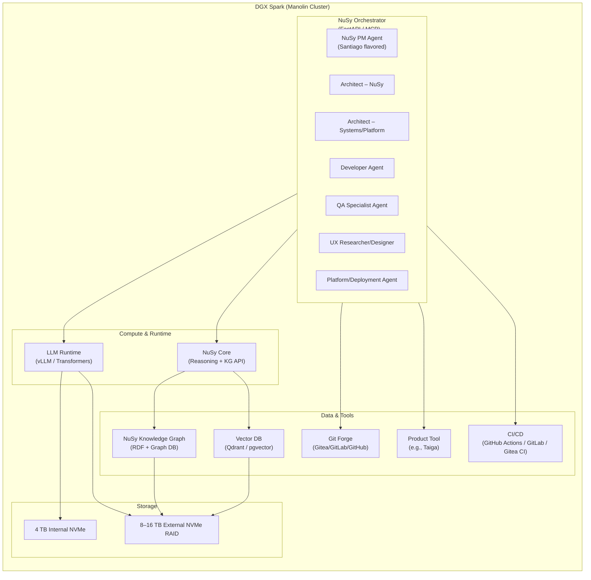

# NuSy “Manolin Cluster” – Architecture Overview  

This document describes the **Manolin Cluster**: a NuSy-based, Santiago-centric multi-agent environment running on a DGX Spark with extended storage.

---

## 1. Conceptual Overview

- **Santiago** = Master NeuroSymbolic reasoner and clinical/product expert.  
- **Manolin** = Apprentices / specialized agents that learn from and assist Santiago.  
- **NuSy** = Knowledge-graph-centric AI framework connecting roles, tools, and reasoning.

The Manolin Cluster is a **single-node AI supercomputer** (DGX Spark) with:

- One or more **Santiago cores** (Mistral-7B-Instruct based).  
- Multiple NuSy role agents:
  - Product Manager
  - Architect – NuSy
  - Architect – Systems/Platform
  - Developer
  - QA Specialist
  - UX Researcher/Designer
  - Platform/Deployment Engineer

These agents coordinate via:

- A **NuSy Orchestrator** (FastAPI / MCP service)  
- A shared **model runtime** (vLLM / Transformers)  
- A **NuSy Knowledge Graph** (RDF + graph DB)  
- Repos, CI/CD, and chat channels.

---

## 2. High-Level Architecture Diagram (Text)

---

## 3. Logical Layers

### 3.1 Execution Layer (LLM & Orchestration)

- **LLM Runtime**
  - Hosts **Mistral-7B-Instruct** as the shared Santiago base model.
  - Exposes an API for all NuSy agents to call.
  - Handles batching and concurrency.

- **NuSy Orchestrator**
  - FastAPI or similar MCP server.
  - Manages:
    - Role routing (which agent handles what)
    - Conversation/session state
    - Tool invocation
    - Logging & metrics

### 3.2 Knowledge & Data Layer

- **NuSy Knowledge Graph**
  - Encodes:
    - Domain knowledge
    - Role definitions
    - Hypotheses & experiments
    - Software artifacts (features, stories, tests)
  - Backed by:
    - Graph DB (e.g., GraphDB, Blazegraph, Neo4j) or
    - RDF store via `rdflib`

- **Vector DB**
  - Stores embeddings for:
    - Repos
    - Specs
    - BDD feature files
    - Clinical/technical docs
  - Used for retrieval-augmented reasoning.

### 3.3 Tooling Layer

- **Git Forge**
  - Central repo for:
    - NuSy code
    - Agent instructions
    - Dev practices
    - MCP service definitions

- **Product Management Tool**
  - Tracks:
    - Epics, features, hypotheses
    - Story maps & milestones

- **CI/CD**
  - Runs tests, linting, type-checks.
  - Deploys updated NuSy services.

---

## 4. Manolin Role Topology

Each role is a **NuSy Agent** with:

- A role-specific **instruction file**
- A defined **input/output contract**
- Specific **tools** they can call

Example:

- **NuSy PM Agent**
  - Input: high-level vision, domain goals
  - Output: hypotheses, features, BDD scenarios, team plans

- **Developer Agent**
  - Input: features, BDD
  - Output: code changes, tests, documentation

- **QA Specialist Agent**
  - Input: features, code, tests
  - Output: extended test suites, quality signals, risk notes

All agents share:

- The **Santiago-core model** via LLM Runtime.
- The **NuSy KG** and Vector DB.
- The same **execution vocabulary** (BDD, 4-layer model, NuSy concepts).

---

## 5. Storage Layout

- **Internal 4 TB NVMe**
  - OS + base software
  - NuSy Core repos
  - Active models (Mistral-7B-Instruct)
  - Hot KG and vector indexes

- **External 8–16 TB NVMe RAID**
  - Additional models and fine-tunes
  - Historical KG snapshots
  - Experiment logs and artifacts
  - Code archive and backups

---

## 6. Scaling Considerations

- **Vertical scaling within DGX Spark:**
  - Add more models & agents as long as memory and compute allow.
  - Use batching and request scheduling to manage concurrency.

- **Horizontal scaling (future):**
  - Additional nodes (e.g., Manolin-Node-2, Manolin-Node-3).
  - Shared NAS or object storage for model and data replication.
  - Kubernetes or similar orchestrator for multi-node scheduling.

---

## 7. Next Steps

1. Implement the initial **NuSy Orchestrator** with:
   - PM, Developer, QA agents
   - Connection to Mistral-7B
2. Stand up:
   - Minimal KG (NuSy ontology + role graph)
   - Vector DB for a subset of repos and specs
3. Start running **live experiments**:
   - Have the Manolin Cluster self-improve:
     - its own roles
     - its own Dev Practices
     - its own infrastructure (within safety limits)

This architecture document should be versioned in the repo and updated as the Manolin Cluster evolves.
