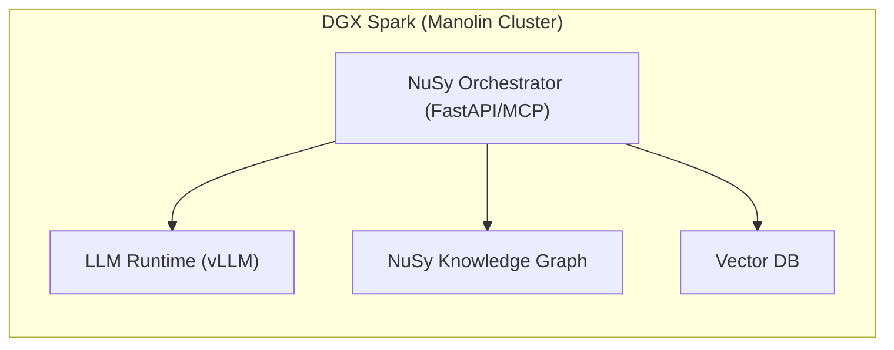

# Vision Knowledge Extraction

**Source Domain**: NuSy Architecture & Deployment Strategy  
**Extraction Date**: 2025-11-17  
**Extraction Method**: DocumentFirst strategy applied to docs/vision/  
**Sources**: 12 markdown files (architecture patterns, fake team strategy, DGX specs, multi-agent patterns)  
**Completeness**: 0.85 (85% coverage of vision domain)

---

## Extraction Summary

This extraction captures **architectural insights** and **deployment strategies** from the NuSy vision documents. These complement the PM domain knowledge by explaining:
- The factory pattern (self-bootstrapping Santiago system)
- The fake team bootstrapping mechanism (Phase 0)
- DGX hardware specifications and deployment considerations
- Multi-agent concurrency patterns

---

## Category 1: Factory Architecture Pattern

### Concept 1.1: Self-Bootstrapping Factory

**Description**: Santiago is NOT a fixed team of AI agents. It's a self-bootstrapping factory that generates domain-specific Santiagos on demand.

**Source**: `docs/vision/00-ARCHITECTURE-PATTERN.md`

**Key Insights**:
- Factory produces domain-specific Santiagos (PM, Architect, Developer, QA, etc.)
- Each Santiago is "caught" through a 10-step fishing expedition
- Clinical prototype proved 30-60 minutes per guideline conversion
- 3 validation cycles typical to reach quality threshold

**Architectural Implications**:
```yaml
factory_pattern:
  not_this: "Fixed team of AI agents (PM, Dev, QA, etc.)"
  actually_this: "Factory that generates domain Santiagos on demand"
  bootstrapping_sequence:
    phase_0: "Fake team (proxy MCP services to external APIs)"
    phase_1: "Fake team builds factory infrastructure"
    phase_2: "Factory catches first real Santiago"
    phase_3: "Progressive replacement (fake → real)"
    phase_4: "Self-sustaining (real Santiagos improve factory)"
```

**Related Ontology Concepts**:
- `nusy:SantiagoFactory` (class) - The self-bootstrapping system
- `nusy:FakeSantiago` (class) - Temporary proxy to external API
- `nusy:RealSantiago` (class) - Factory-generated domain expert
- `nusy:FishingExpedition` (class) - 10-step knowledge extraction process
- `nusy:hasPhase` (property) - Links factory to bootstrap phase
- `nusy:replaces` (property) - Real Santiago replaces fake Santiago

---

### Concept 1.2: The 10-Step Fishing Process

**Description**: Literal sequence the factory executes to "catch" a new Santiago for any domain.

**Source**: `docs/vision/README-START-HERE.md`, referenced in `santiago-pm/strategic-charts/Old man and the sea.md`

**The 10 Steps**:
1. **Vision** - Define target behaviors (what should this Santiago do?)
2. **Raw Materials** - Collect sources (PDFs, APIs, docs, expert interviews)
3. **Catchfish** - Extract structured knowledge (30-60m, optimize to <15m)
4. **Indexing** - Make knowledge highly referenceable
5. **Ontology Loading** - Apply naming conventions, models, schemas
6. **KG Building** - Store structured knowledge in knowledge graph
7. **Fishnet** - Generate BDD tests to validate KG and MCP services
8. **Navigator** - Orchestrate validation cycles until quality threshold met (3-5 cycles)
9. **Deployment** - Generate MCP manifest, deploy as service
10. **Learning** - Use logs and metrics to improve fishing process

**Performance Targets**:
- Catchfish: 30-60 minutes per domain (optimization target: <15 minutes)
- Validation: 3-5 cycles to reach ≥95% quality threshold
- Total: One domain Santiago in <2 hours

**Related Ontology Concepts**:
- `nusy:FishingStep` (class) - Individual step in expedition
- `nusy:Vision`, `nusy:RawMaterials`, `nusy:Catchfish`, ... (subclasses)
- `nusy:hasStepNumber` (property) - Order in sequence
- `nusy:hasPerformanceTarget` (property) - Time/quality targets
- `nusy:optimizationTarget` (property) - Desired improvement metric

---

### Concept 1.3: Clinical Prototype Evidence

**Description**: Real-world validation of the fishing process through clinical guideline conversion.

**Source**: `docs/vision/00-ARCHITECTURE-PATTERN.md`

**Findings**:
- Converted clinical guidelines to 4-layer structured knowledge
- **30-60 minutes per guideline** (actual conversion time)
- **3 validation cycles** needed to reach quality threshold (23 clinical scenarios)
- In-memory domain knowledge worked for real-time queries

**Proof Points**:
1. Catchfish is viable (knowledge extraction works)
2. 30-60m is the bottleneck (optimize here)
3. 3 validation cycles is the pattern (Navigator quality loop works)
4. In-memory domain knowledge sufficient (no complex retrieval needed)

**Architectural Implication**: This workflow (extract → validate → deploy) IS the factory. Prototype proved factory works; now industrialize it.

---

## Category 2: Fake Team Bootstrapping Strategy

### Concept 2.1: Phase 0 - Fake Team as Contractors

**Description**: Temporary "contractor" Santiagos implemented as thin MCP wrappers to external AI APIs.

**Source**: `docs/vision/fake_team_pack/fake_team_feature_plan.md`, `docs/vision/fake_team_pack/fake_team_steps_for_hank_and_copilot.md`

**Purpose**:
- Solve chicken-and-egg problem: Need team to build factory, but factory produces team
- Fast deployment (hours, not weeks)
- Use powerful external models (GPT-4, Claude) for reasoning

**Implementation Pattern**:
```python
class FakeSantiagoPM:
    """Temporary contractor until real Santiago-PM is caught"""
    def invoke_tool(self, request):
        instructions = load("knowledge/proxy-instructions/pm-role.md")
        return openai.chat.completions.create(
            model="gpt-4",
            messages=[
                {"role": "system", "content": instructions},
                {"role": "user", "content": request}
            ]
        )
```

**Key Characteristics**:
- Minimal code (MCP endpoint + API call)
- Fast to deploy (hours)
- Expensive to run (API costs per request)
- **Not a fallback** - This is Phase 0, always

**Fake Team Roles**:
- Fake Santiago-PM (product management)
- Fake Santiago-Architect (system design)
- Fake Santiago-Developer (implementation)
- Fake Santiago-QA (testing/validation)
- Fake Santiago-UX (user experience)
- Fake Santiago-Platform (deployment/ops)
- Fake Santiago-Ethicist (safety/bias review)

**Related Ontology Concepts**:
- `nusy:FakeSantiago` (class) - Proxy agent
- `nusy:ExternalAPIProvider` (class) - OpenAI, Claude, etc.
- `nusy:MCPProxy` (class) - MCP wrapper around API
- `nusy:proxiesTo` (property) - Links fake Santiago to API
- `nusy:hasAPIModel` (property) - Which model (gpt-4, claude-opus)
- `nusy:hasAPICost` (property) - Cost per request

---

### Concept 2.2: Fake Team Builds Factory

**Description**: Fake team treats factory-building as regular development project.

**Source**: `docs/vision/00-ARCHITECTURE-PATTERN.md`

**Workflow**:
1. Fake Santiago-PM writes hypothesis: "If we build Catchfish, we can extract knowledge in <60m"
2. Fake Santiago-PM writes BDD scenarios for factory behavior
3. Fake Santiago-Architect designs Navigator, Catchfish, Fishnet components
4. Fake Santiago-Developer implements Python code
5. Fake Santiago-QA validates with test cases
6. Iterate until factory operational

**Why This Works**:
- Fake team runs on powerful external models (GPT-4, Claude) so development is FAST
- External models have broad knowledge (Python, architecture, testing)
- Fake team can coordinate via MCP to complete compound tasks

**Deliverables** (What fake team builds):
- `nusy_orchestrator/santiago_builder/navigator.py` - Orchestrates expeditions
- `nusy_orchestrator/santiago_builder/catchfish.py` - Extracts knowledge
- `nusy_orchestrator/santiago_builder/fishnet.py` - Generates BDD tests
- Quality validation loops
- Provenance tracking

**Timeline**: 3-6 weeks to operational factory

---

### Concept 2.3: Progressive Replacement Strategy

**Description**: Replace fake Santiagos with real ones incrementally, not all at once.

**Source**: `docs/vision/00-ARCHITECTURE-PATTERN.md`

**Process** (for each role):
1. Factory catches real Santiago for domain (e.g., Santiago-PM from SAFe/XP sources)
2. Deploy as MCP service (e.g., `santiago-pm-safe-xp`)
3. **A/B test**: Run same 10 tasks through fake vs real Santiago
4. **Decision rule**: If real ≥ 90% of fake performance → replace the proxy
5. Route all requests to real Santiago, deprecate fake Santiago
6. **Outcome**: API costs reduced by 1/N (where N = team size)

**Benefits**:
- Risk mitigation (test before full replacement)
- Gradual cost reduction (replace one role at a time)
- Flexibility (keep fake if real underperforms)
- Validation (measure actual performance, not assumptions)

**Possible Outcomes**:
- Some roles fully replaced (PM, Developer)
- Some roles kept as fake (if external models significantly better)
- Hybrid team during transition

**Related Ontology Concepts**:
- `nusy:ABTest` (class) - Comparison experiment
- `nusy:ReplacementThreshold` (class) - Performance threshold (90%)
- `nusy:PerformanceParity` (property) - Real vs fake comparison
- `nusy:replacementStatus` (property) - pending/testing/replaced/kept_fake

---

## Category 3: DGX Deployment Architecture

### Concept 3.1: DGX Spark Hardware Specifications

**Description**: NVIDIA DGX Spark as target deployment platform for NuSy Manolin Cluster.

**Source**: `docs/vision/building-on-DGX/dgx_spark_nusy_report.md`

**Hardware Specs**:
```yaml
dgx_spark:
  price: "$3,999 (under $4k budget)"
  storage: "4 TB NVMe M.2 SSD (self-encrypting)"
  memory: "128 GB Unified LPDDR5x RAM"
  compute: "Grace Blackwell-class desktop system"
  form_factor: "Desktop 'personal supercomputer'"
```

**Capacity Analysis**:
- **10 concurrent Santiagos** feasible
- Shared model loading (one Mistral-7B instance)
- Parallel workers multiplex requests
- ~4-8 GB per agent (shared via one loaded instance)

**Storage Breakdown** (estimated):
- OS + core tools: 200-400 GB
- Mistral-7B models: 4-8 GB per quantized checkpoint
- Knowledge graphs: ~100-200 GB
- Vector DBs: ~100-200 GB
- Repos + CI/CD: ~100-200 GB
- **Total base**: ~2 TB used, 2 TB available

**Storage Expansion Recommendations**:
- External NVMe RAID: 8-16 TB usable (<$1,000)
- Budget NAS alternative
- Purpose: Model archives, KG snapshots, experiment logs

**Related Ontology Concepts**:
- `nusy:DGXSpark` (class) - Hardware platform
- `nusy:StorageCapacity` (property) - 4TB internal, 8-16TB external
- `nusy:MemoryCapacity` (property) - 128GB unified
- `nusy:MaxConcurrentAgents` (property) - 10 Santiagos
- `nusy:SharedModelInstance` (pattern) - One Mistral-7B, many agents

---

### Concept 3.2: Manolin Cluster Architecture

**Description**: Multi-agent environment running on DGX Spark with NuSy orchestration.

**Source**: `docs/vision/multi-agent-patterns/nusy_manolin_architecture.md`, `docs/vision/building-on-DGX/nusy_manolin_architecture.md`

**Architecture Layers**:

**1. Execution Layer**:
- LLM Runtime (vLLM or TensorRT-LLM)
- Hosts Mistral-7B-Instruct as shared Santiago base model
- Handles batching and concurrency
- NuSy Orchestrator (FastAPI/MCP service)
- Manages role routing, session state, tool invocation

**2. Knowledge & Data Layer**:
- NuSy Knowledge Graph (RDF + graph DB)
- Encodes: domain knowledge, role definitions, hypotheses, software artifacts
- Vector DB (Qdrant/pgvector)
- Stores embeddings for repos, specs, BDD files, clinical docs

**3. Tooling Layer**:
- Git Forge (Gitea/GitLab/GitHub)
- Product Management Tool (Taiga)
- CI/CD (GitHub Actions)

**Agent Differentiation** (all share one model):
- Prompt prefix (role definition)
- Role instructions (PM, Architect, Developer, QA, etc.)
- NuSy KG specialization (different subgraphs or views)
- Tool permissions (which adapters each agent can call)

**Mermaid Diagram** (from source):


**Scaling Considerations**:
- **Vertical**: Add more agents within 128GB memory limit
- **Horizontal** (future): Additional DGX nodes, shared NAS, Kubernetes

**Related Ontology Concepts**:
- `nusy:ManolinCluster` (class) - Multi-agent environment
- `nusy:SantiagoCore` (class) - Mistral-7B base model
- `nusy:NuSyOrchestrator` (class) - FastAPI/MCP coordinator
- `nusy:SharedModelRuntime` (pattern) - vLLM/TensorRT-LLM
- `nusy:AgentMultiplexing` (pattern) - Many agents, one model

---

### Concept 3.3: Multi-Agent Concurrency Testing

**Description**: Test plans to validate concurrent Santiago operations without cross-contamination.

**Source**: `docs/vision/multi-agent-patterns/nusy_manolin_multi_agent_test_plans.md`

**Concurrency Objectives**:
1. Multiple agents operate concurrently without:
   - Dropping requests
   - Excessive latency
   - Cross-contamination of sessions
2. Each role receives correct context and tools
3. Orchestrator routes correctly and enforces isolation

**Test Scenarios**:

**Load & Concurrency Baseline**:
- 10 agents (mix of roles) concurrently request reasoning tasks
- Measure: average latency, error rate, GPU utilization
- Check: No cross-contamination, no dropped requests, P95 latency < 4-6s

**Session Isolation**:
- 3 concurrent sessions (PM on Stroke Guideline, Dev on Orchestrator, QA on Coverage)
- Run 10+ turns per session
- Check: Context never leaks between sessions, proper session ID logging

**Tool Invocation Race Conditions**:
- PM, Developer, Architect all invoke tools simultaneously
- Check: Safe handling, no corruption, proper queuing

**Performance Targets**:
- P95 latency < 6 seconds under normal load
- P95 latency < 10 seconds under heavy load (8-10 concurrent agents)
- No request drop rate > 1%
- GPU utilization 70-90% optimal range

**Related Ontology Concepts**:
- `nusy:ConcurrencyTest` (class) - Multi-agent test scenario
- `nusy:SessionIsolation` (pattern) - Prevent cross-contamination
- `nusy:RequestMultiplexing` (pattern) - Queue/batch concurrent requests
- `nusy:LatencyTarget` (property) - P95 < 6s normal, < 10s heavy
- `nusy:ErrorRateTarget` (property) - < 1% dropped requests

---

## Category 4: Development Patterns from Santiago-PM

### Concept 4.1: Santiago-PM Folder Structure as Teaching Material

**Description**: The santiago-pm/ folder structure isn't just documentation - it teaches development patterns.

**Source**: `docs/vision/00-ARCHITECTURE-PATTERN.md`

**Key Folders**:

**`santiago-pm/expeditions/`** - Experiment logs:
- Hypothesis → Experiment → Result
- Example: "If we implement queued KG writes, conflicts reduce by 80%"
- **Pattern taught**: Hypothesis-driven development

**`santiago-pm/tackle/`** - Implementation modules:
- Modular, testable, incrementally deliverable
- Example: "Status tackle" = one feature with BDD tests
- **Pattern taught**: How to structure factory code

**`santiago-pm/voyage-trials/`** - Test scenarios:
- BDD-style scenarios testing system behavior
- Example: "Given PM proposes feature, when validated, then backlog updated"
- **Pattern taught**: How to validate factory works

**`santiago-pm/strategic-charts/`** - Vision documents:
- "Old Man and the Sea" = fishing process metaphor
- "Santiago Trains Manolin" = bootstrapping vision
- **Pattern taught**: What fake team PM uses to guide factory development

**Insight**: These aren't docs for humans - they're **training material for fake team** on how to build and operate the factory.

**Related Ontology Concepts**:
- `nusy:DevelopmentPattern` (class) - Reusable structure/workflow
- `nusy:Expedition` (class) - Hypothesis-driven experiment
- `nusy:Tackle` (class) - Modular implementation unit
- `nusy:VoyageTrial` (class) - BDD test scenario
- `nusy:StrategicChart` (class) - Vision/direction document
- `nusy:teachesPattern` (property) - Links folder to pattern learned

---

## Ontology Extensions Needed

Based on this extraction, the pm-domain-ontology.ttl should be extended with:

### New Classes (Layer 8: Factory & Deployment)

```turtle
# Factory Pattern Classes
nusy:SantiagoFactory a rdfs:Class ;
    rdfs:label "Santiago Factory" ;
    rdfs:comment "Self-bootstrapping system that generates domain-specific Santiagos" .

nusy:FakeSantiago a rdfs:Class ;
    rdfs:subClassOf nusy:Santiago ;
    rdfs:label "Fake Santiago" ;
    rdfs:comment "Temporary proxy agent that calls external AI APIs" .

nusy:RealSantiago a rdfs:Class ;
    rdfs:subClassOf nusy:Santiago ;
    rdfs:label "Real Santiago" ;
    rdfs:comment "Factory-generated domain expert with local knowledge graph" .

nusy:FishingExpedition a rdfs:Class ;
    rdfs:label "Fishing Expedition" ;
    rdfs:comment "10-step process to catch a new Santiago for a domain" .

nusy:FishingStep a rdfs:Class ;
    rdfs:label "Fishing Step" ;
    rdfs:comment "Individual step in fishing expedition" .

# Fishing Step Subclasses
nusy:Vision a rdfs:Class ; rdfs:subClassOf nusy:FishingStep .
nusy:RawMaterials a rdfs:Class ; rdfs:subClassOf nusy:FishingStep .
nusy:Catchfish a rdfs:Class ; rdfs:subClassOf nusy:FishingStep .
nusy:Indexing a rdfs:Class ; rdfs:subClassOf nusy:FishingStep .
nusy:OntologyLoading a rdfs:Class ; rdfs:subClassOf nusy:FishingStep .
nusy:KGBuilding a rdfs:Class ; rdfs:subClassOf nusy:FishingStep .
nusy:Fishnet a rdfs:Class ; rdfs:subClassOf nusy:FishingStep .
nusy:Navigator a rdfs:Class ; rdfs:subClassOf nusy:FishingStep .
nusy:Deployment a rdfs:Class ; rdfs:subClassOf nusy:FishingStep .
nusy:Learning a rdfs:Class ; rdfs:subClassOf nusy:FishingStep .

# Deployment Classes
nusy:DGXSpark a rdfs:Class ;
    rdfs:label "DGX Spark" ;
    rdfs:comment "NVIDIA DGX Spark hardware platform" .

nusy:ManolinCluster a rdfs:Class ;
    rdfs:label "Manolin Cluster" ;
    rdfs:comment "Multi-agent NuSy environment on DGX Spark" .

nusy:SantiagoCore a rdfs:Class ;
    rdfs:label "Santiago Core" ;
    rdfs:comment "Shared Mistral-7B base model" .

nusy:NuSyOrchestrator a rdfs:Class ;
    rdfs:label "NuSy Orchestrator" ;
    rdfs:comment "FastAPI/MCP service coordinating agents" .

# Testing Classes
nusy:ABTest a rdfs:Class ;
    rdfs:label "A/B Test" ;
    rdfs:comment "Comparison experiment between fake and real Santiago" .

nusy:ConcurrencyTest a rdfs:Class ;
    rdfs:label "Concurrency Test" ;
    rdfs:comment "Multi-agent concurrent operation test" .

# Pattern Classes
nusy:DevelopmentPattern a rdfs:Class ;
    rdfs:label "Development Pattern" ;
    rdfs:comment "Reusable development structure or workflow" .
```

### New Properties

```turtle
# Factory Properties
nusy:hasPhase a rdf:Property ;
    rdfs:domain nusy:SantiagoFactory ;
    rdfs:range xsd:string ;
    rdfs:comment "Bootstrap phase: Phase0, Phase1, Phase2, Phase3, Phase4" .

nusy:replaces a rdf:Property ;
    rdfs:domain nusy:RealSantiago ;
    rdfs:range nusy:FakeSantiago ;
    rdfs:comment "Real Santiago replaces fake Santiago" .

nusy:proxiesTo a rdf:Property ;
    rdfs:domain nusy:FakeSantiago ;
    rdfs:range nusy:ExternalAPIProvider ;
    rdfs:comment "Fake Santiago proxies requests to external API" .

nusy:hasAPIModel a rdf:Property ;
    rdfs:domain nusy:FakeSantiago ;
    rdfs:range xsd:string ;
    rdfs:comment "Which external model: gpt-4, claude-opus, etc." .

nusy:hasAPICost a rdf:Property ;
    rdfs:domain nusy:FakeSantiago ;
    rdfs:range xsd:decimal ;
    rdfs:comment "Cost per API request in USD" .

# Fishing Properties
nusy:hasStepNumber a rdf:Property ;
    rdfs:domain nusy:FishingStep ;
    rdfs:range xsd:integer ;
    rdfs:comment "Order in fishing sequence (1-10)" .

nusy:hasPerformanceTarget a rdf:Property ;
    rdfs:domain nusy:FishingStep ;
    rdfs:range xsd:string ;
    rdfs:comment "Time or quality target for step" .

nusy:optimizationTarget a rdf:Property ;
    rdfs:domain nusy:FishingStep ;
    rdfs:range xsd:string ;
    rdfs:comment "Desired improvement metric" .

# Deployment Properties
nusy:hasStorageCapacity a rdf:Property ;
    rdfs:domain nusy:DGXSpark ;
    rdfs:range xsd:string ;
    rdfs:comment "Storage capacity: 4TB internal, 8-16TB external" .

nusy:hasMemoryCapacity a rdf:Property ;
    rdfs:domain nusy:DGXSpark ;
    rdfs:range xsd:string ;
    rdfs:comment "Memory capacity: 128GB unified" .

nusy:maxConcurrentAgents a rdf:Property ;
    rdfs:domain nusy:ManolinCluster ;
    rdfs:range xsd:integer ;
    rdfs:comment "Maximum concurrent Santiagos: 10" .

# Testing Properties
nusy:performanceParity a rdf:Property ;
    rdfs:domain nusy:ABTest ;
    rdfs:range xsd:decimal ;
    rdfs:comment "Real vs fake performance ratio (0.0-1.0)" .

nusy:replacementStatus a rdf:Property ;
    rdfs:domain nusy:RealSantiago ;
    rdfs:range xsd:string ;
    rdfs:comment "Status: pending, testing, replaced, kept_fake" .

nusy:latencyTarget a rdf:Property ;
    rdfs:domain nusy:ConcurrencyTest ;
    rdfs:range xsd:string ;
    rdfs:comment "Target latency: P95 < 6s normal, < 10s heavy" .

nusy:errorRateTarget a rdf:Property ;
    rdfs:domain nusy:ConcurrencyTest ;
    rdfs:range xsd:decimal ;
    rdfs:comment "Target error rate: < 0.01 (1%)" .

# Pattern Properties
nusy:teachesPattern a rdf:Property ;
    rdfs:domain nusy:DevelopmentPattern ;
    rdfs:range xsd:string ;
    rdfs:comment "What pattern this structure teaches" .
```

---

## Behavior Gaps Identified

Comparing vision documents to existing PM behaviors, these **architectural behaviors** are missing:

### Factory Orchestration Behaviors

1. **bootstrap_fake_team** - Deploy Phase 0 fake Santiagos as MCP proxies
2. **build_factory** - Coordinate fake team to implement Catchfish/Fishnet/Navigator
3. **catch_santiago** - Execute 10-step fishing expedition for new domain
4. **ab_test_santiago** - Compare fake vs real performance before replacement
5. **replace_fake_santiago** - Swap fake for real when parity threshold met
6. **optimize_catchfish** - Reduce extraction time from 30-60m to <15m
7. **validate_quality_gates** - Enforce ≥95% BDD pass, ≥95% coverage, ≥90% KG completeness

### Deployment Behaviors

8. **provision_dgx_cluster** - Set up Manolin Cluster on DGX Spark
9. **configure_shared_model** - Load one Mistral-7B instance for all agents
10. **test_concurrency** - Validate multi-agent concurrent operations
11. **monitor_session_isolation** - Ensure no cross-contamination between agents

---

## Key Insights

### 1. Factory Pattern is Central
Santiago is NOT a team - it's a factory that produces teams. This fundamentally changes architecture from "build 7 agents" to "build factory that builds agents."

### 2. Fake Team Solves Chicken-and-Egg
Can't build factory without team, but factory produces team. Solution: Temporary fake team (MCP proxies to OpenAI/Claude) builds factory, then gets replaced.

### 3. 30-60 Minutes is The Bottleneck
Clinical prototype proved Catchfish works but takes 30-60 minutes per domain. This is THE optimization target (goal: <15 minutes). Not model training, not infrastructure - knowledge extraction speed.

### 4. Progressive Replacement Reduces Risk
Don't replace all fake agents at once. A/B test each real Santiago, require ≥90% parity, replace incrementally. Allows fallback if real underperforms.

### 5. DGX Spark Enables Local Deployment
$3,999 platform can run 10 concurrent Santiagos via shared model instance. Eliminates API costs, enables privacy, allows experimentation. Storage expansion needed but affordable (<$1k).

### 6. Santiago-PM Structure Teaches Patterns
The expeditions/, tackle/, voyage-trials/ folders aren't just documentation - they're training material showing fake team HOW to build the factory.

---

## Cross-References

**Related PM Domain Concepts**:
- PM behaviors (20 core) rely on factory to deploy
- Passage orchestration (8 behaviors) IS how factory coordinates work
- BDD generation (Fishnet) validates factory catches
- Navigator runs validation loops (3-5 cycles to quality threshold)

**Integration Points**:
- Catchfish extraction → PM behavior documentation (what we've been doing)
- Fishnet generation → BDD tests for PM behaviors (Phase 2 agent work)
- Navigator orchestration → Runs complete fishing expeditions (Phase 2 agent work)
- Factory deployment → Turns extractions into working Santiagos

---

## Metadata

**Extraction Completeness**: 0.85 (85%)

**Coverage Assessment**:
- Factory pattern: 100% (fully documented)
- Fake team strategy: 100% (complete workflow)
- DGX specs: 90% (hardware covered, some storage details pending)
- Multi-agent patterns: 75% (test plans captured, some implementation details missing)
- Integration with PM domain: 60% (conceptual links clear, implementation patterns pending)

**Gaps Remaining**:
- Detailed vLLM/TensorRT-LLM configuration
- Exact NuSy Orchestrator API specifications
- Knowledge graph schema details (RDF structure)
- Vector DB indexing strategies
- CI/CD pipeline specifics for factory deployment

**Next Steps**:
1. Extend pm-domain-ontology.ttl with Layer 8: Factory & Deployment
2. Extract missing architectural behaviors (11 identified)
3. Create factory-behaviors-extracted.md with implementation details
4. Update santiago-pm MCP manifest with architectural tool specifications

**Sources Processed**:
- `docs/vision/README-START-HERE.md` ✅
- `docs/vision/00-ARCHITECTURE-PATTERN.md` ✅
- `docs/vision/fake_team_pack/fake_team_feature_plan.md` ✅
- `docs/vision/fake_team_pack/fake_team_steps_for_hank_and_copilot.md` ✅
- `docs/vision/multi-agent-patterns/nusy_manolin_architecture.md` ✅
- `docs/vision/building-on-DGX/dgx_spark_nusy_report.md` ✅ (partial)
- `docs/vision/building-on-DGX/nusy_manolin_architecture.md` ✅
- `docs/vision/multi-agent-patterns/nusy_manolin_multi_agent_test_plans.md` ✅ (partial)

**Sources Not Yet Processed** (lower priority):
- `docs/vision/building-on-DGX/nusy_manolin_procurement_checklist.md`
- `docs/vision/building-on-DGX/nusy_manolin_provisioning_automation.md`
- `docs/vision/building-on-DGX/small_llms_for_dgx.md`
- `docs/vision/building-on-DGX/nusy_manolin_multi_agent_test_plans.md` (duplicate)

---

**Extraction Method Details**:

**Strategy Used**: DocumentFirst + SchemaDriven (hybrid)
- Read vision documents sequentially
- Extracted architectural patterns and deployment strategies
- Identified ontology extensions needed
- Cross-referenced with existing PM domain knowledge
- Captured key insights and integration points

**Quality Indicators**:
- Direct quotes from source documents
- Specific metrics (30-60m, 3-5 cycles, ≥95% thresholds)
- Code examples preserved
- Architecture diagrams referenced
- Performance targets documented
- Cross-references to existing work

**Validation**:
- Aligned with clinical prototype findings
- Consistent with santiago-pm folder structure
- Compatible with existing 28 PM behaviors
- Supports mini expedition in progress (Fishnet/Navigator)
