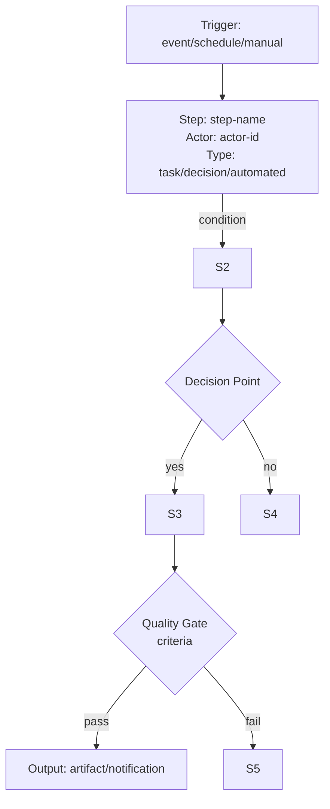

# NuSy PM Passage System

## Overview

The Passage System provides structured processes for coordinating work between humans, agents, and automated systems in the NuSy development ecosystem. Passages define sequences of activities, decision points, and handoffs that ensure consistent execution of complex tasks.

## Domain Concepts

### Passage Types

1. **Team Passages**: Processes for human team collaboration
2. **Agent Passages**: Autonomous processes for AI agents
3. **Hybrid Passages**: Mixed human-agent collaborative processes
4. **Integration Passages**: System integration and deployment processes

### Passage Components

- **Triggers**: Events that initiate passage execution
- **Steps**: Individual activities or decisions in the passage
- **Actors**: Humans, agents, or systems that perform steps
- **Transitions**: Rules for moving between steps
- **Outputs**: Artifacts produced by the passage
- **Quality Gates**: Validation points in the passage

### Passage States

- `draft`: Being designed or modified
- `active`: Available for execution
- `deprecated`: No longer recommended but still available
- `archived`: Preserved for historical reference

## Passage Categories

### Team Passages

- **Feature Development**: From hypothesis to deployment
- **Experiment Design**: Planning and executing experiments
- **Knowledge Capture**: Documenting and storing learnings
- **Review Processes**: Code, design, and decision reviews

### Agent Passages

- **Code Generation**: From specifications to implementation
- **Testing Automation**: Running and analyzing test suites
- **Documentation Updates**: Maintaining current documentation
- **Quality Assurance**: Automated quality checks

### Hybrid Passages

- **Tackle Development**: Human specification + agent implementation
- **Experiment Analysis**: Agent data processing + human interpretation
- **Knowledge Synthesis**: Agent research + human validation
- **System Integration**: Agent setup + human verification

## Passage Definition Format

Passages are defined using a structured YAML format that captures all necessary components for execution.

### Basic Structure

```yaml
id: passage-unique-identifier
name: Human-readable passage name
description: Detailed description of the passage purpose
category: team | agent | hybrid | integration
version: semantic version (e.g., 1.0.0)

metadata:
  created_by: creator identifier
  created_at: ISO timestamp
  updated_at: ISO timestamp
  tags: [list, of, tags]

actors:
  - id: actor-identifier
    name: Actor Name
    type: human | agent | system
    role: specific role description

triggers:
  - type: event | schedule | manual
    condition: trigger condition
    parameters: trigger parameters

steps:
  - id: step-identifier
    name: Step Name
    description: What this step accomplishes
    actor: actor-id
    type: task | decision | approval | automated
    inputs: required inputs
    outputs: produced outputs
    timeout: optional timeout duration
    quality_gate: optional validation criteria

transitions:
  - from: source-step-id
    to: target-step-id
    condition: transition condition
    actions: actions to perform on transition

outputs:
  - name: output-name
    type: artifact | notification | update
    location: where output is stored
    format: output format specification

quality_gates:
  - step: step-id
    criteria: validation criteria
    actions: actions if criteria not met
```

## Visualization

### Mermaid Diagram Support

Passages can be automatically visualized using Mermaid diagrams to provide clear flowcharts of the passage execution logic. This enables both human understanding and automated diagram generation for documentation and monitoring.

#### Mermaid Generation Rules

Passages are converted to Mermaid flowcharts using the following mapping:

- **Triggers** → Start nodes (rounded rectangles)
- **Steps** → Process nodes (rectangles)
- **Decisions** → Diamond nodes
- **Transitions** → Arrows with labels
- **Quality Gates** → Validation checkpoints
- **Outputs** → End nodes (rounded rectangles)

#### Mermaid Diagram Format



#### Diagram Generation Process

1. **Parse Passage YAML**: Extract actors, steps, transitions, and outputs
2. **Map Components**: Convert passage elements to Mermaid syntax
3. **Add Styling**: Apply consistent colors and shapes for different component types
4. **Generate Diagram**: Output complete Mermaid flowchart code

#### Visualization Categories

- **Execution Flow**: Shows the complete passage execution path
- **Actor Assignment**: Highlights which actors perform which steps
- **Decision Points**: Emphasizes conditional logic and branching
- **Quality Gates**: Shows validation and approval points
- **Integration Points**: Displays external system interactions

## Execution Engine

### Passage Execution States

- `pending`: Waiting for trigger
- `running`: Currently executing
- `waiting`: Waiting for external input or approval
- `completed`: Successfully finished
- `failed`: Terminated with error
- `cancelled`: Manually or automatically cancelled

### Execution Context

Each passage execution maintains:

- **Execution ID**: Unique identifier for this run
- **Parameters**: Input parameters for this execution
- **State**: Current execution state
- **Step History**: Record of completed steps
- **Artifacts**: Generated outputs and intermediate results
- **Timeline**: Start/end times and step durations

## Integration Points

### Knowledge Graph Integration

Passages are stored as KG entities with relationships:

- `Passage → hasStep → Step`
- `Step → performedBy → Actor`
- `PassageExecution → instanceOf → Passage`
- `PassageExecution → produced → Artifact`

### MCP Integration

Passages can invoke MCP endpoints for:

- **Agent Coordination**: Triggering agent actions
- **System Integration**: Calling external services
- **Data Processing**: Transforming passage data
- **Notification**: Sending alerts and updates

### Tackle Integration

Passages coordinate tackle operations:

- **Status Updates**: Tracking passage progress
- **Artifact Management**: Storing passage outputs
- **Dependency Resolution**: Managing passage prerequisites

## Quality Assurance

### Validation Rules

1. **Completeness**: All required fields present
2. **Consistency**: Referenced actors and steps exist
3. **Reachability**: All steps can be reached from triggers
4. **Termination**: No infinite loops or dead ends

### Testing

- **Unit Tests**: Individual step validation
- **Integration Tests**: End-to-end passage execution
- **Performance Tests**: Passage execution timing
- **Load Tests**: Concurrent passage execution

## Governance

### Passage Lifecycle

1. **Proposal**: New passage requirements identified
2. **Design**: Passage specification created
3. **Review**: Peer review and validation
4. **Testing**: Passage testing and refinement
5. **Approval**: Passage approved for production use
6. **Deployment**: Passage made available for execution
7. **Monitoring**: Passage performance and usage tracked
8. **Evolution**: Passage updated based on feedback and needs

### Access Control

- **Creation**: Who can create new passages
- **Execution**: Who can trigger passage execution
- **Modification**: Who can update existing passages
- **Archival**: Who can archive deprecated passages

## Examples

### Team Feature Development Passage

```yaml
id: team-feature-development
name: Team Feature Development
description: End-to-end process for developing new features
category: team

actors:
  - id: product-manager
    name: Product Manager
    type: human
  - id: architect
    name: Architect
    type: agent
  - id: developer
    name: Developer
    type: agent

steps:
  - id: hypothesis-definition
    name: Define Hypothesis
    actor: product-manager
    type: task
  - id: spec-generation
    name: Generate Specifications
    actor: architect
    type: automated
  - id: implementation
    name: Implement Feature
    actor: developer
    type: automated
```

### Agent Code Generation Passage

```yaml
id: agent-code-generation
name: Agent Code Generation
description: Automated code generation from specifications
category: agent

actors:
  - id: santiago
    name: Santiago
    type: agent

steps:
  - id: spec-analysis
    name: Analyze Specifications
    actor: santiago
    type: automated
  - id: code-generation
    name: Generate Code
    actor: santiago
    type: automated
  - id: test-generation
    name: Generate Tests
    actor: santiago
    type: automated
```

#### Mermaid Diagram Example

```mermaid
flowchart TD
    T1[Trigger: manual<br/>Code Generation Request] --> S1
    
    S1[Step: spec-analysis<br/>Actor: santiago<br/>Type: automated<br/>Analyze Specifications]
    S1 --> S2
    
    S2[Step: code-generation<br/>Actor: santiago<br/>Type: automated<br/>Generate Code]
    S2 --> S3
    
    S3[Step: test-generation<br/>Actor: santiago<br/>Type: automated<br/>Generate Tests]
    S3 --> O1
    
    O1[Output: Generated Code + Tests<br/>Location: repository]
```</content>
<parameter name="filePath">/Users/hankhead/Projects/Personal/nusy-product-team/nusy_pm/workflows/workflow-system.md
